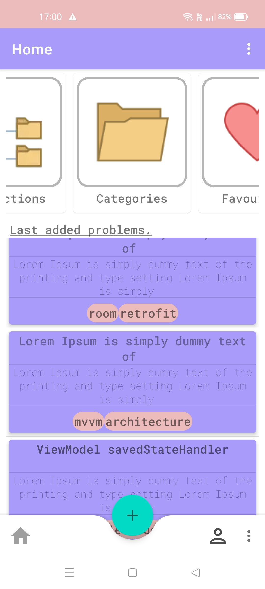
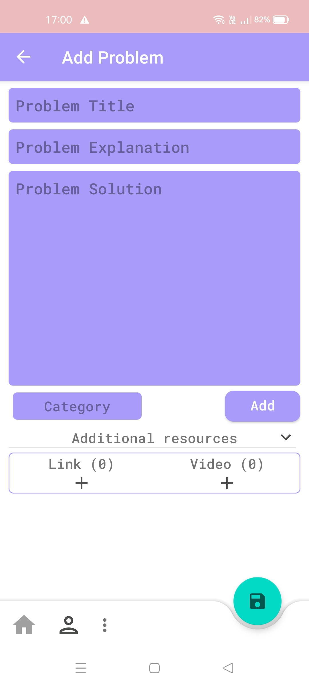
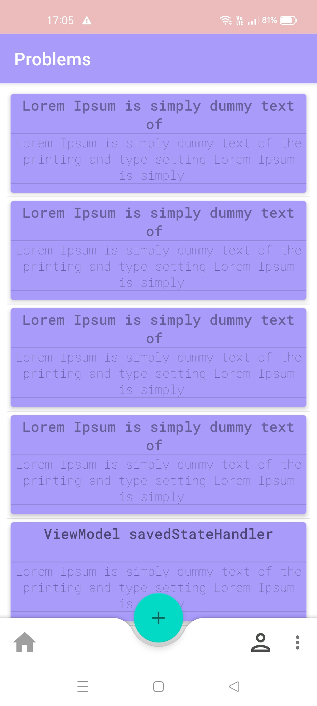
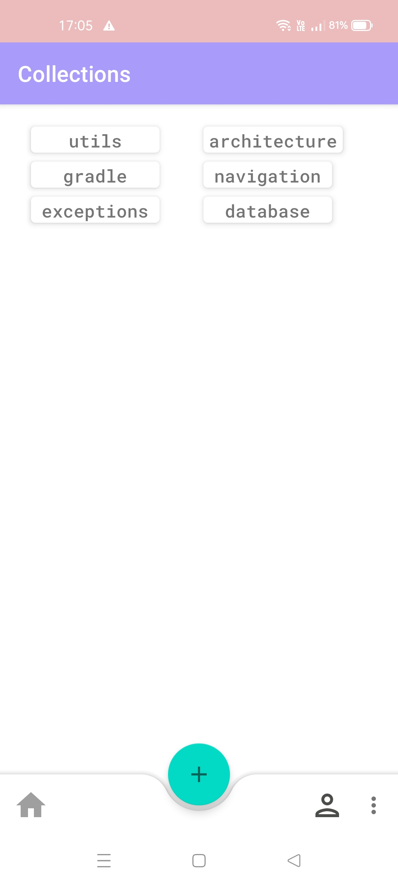
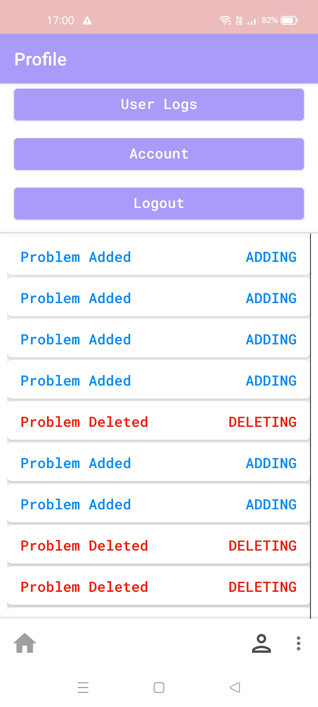

# Table of Content
- [About](https://github.com/scotoglu/hadila-app/new/master?readme=1#about)
- [Screenshots](https://github.com/scotoglu/hadila-app/new/master?readme=1#screenshots)
- [Features](https://github.com/scotoglu/hadila-app/new/master?readme=1#features)
- [Library and Tools](https://github.com/scotoglu/hadila-app/new/master?readme=1#library-and-tools)
- [Architecture](https://github.com/scotoglu/hadila-app/new/master?readme=1#architecture)

## About
I developed the Hadila app to save  frequently faced problems that I can't remember exact solutions when coding android application.
It's happens to me generally.
But purpose of app is learning  libraries and improving my development skills.
I have spent a lot of time when searching below libraries and tools and learnt a lot things. 
Some of them I used  for the first time. I will continue to develop on this app because it kind of roadmap to me.  

## Screenshots

  
   
  
    
  

## Features
- Saving problems with solutions
- Saving used resources as url 
- Categorizing problems
- Creating collections

## Library and Tools
- DataBinding
- ViewModel
- Navigation Component
- Dagger Hilt
- Lifecycle
- Material Design
- FirebaseAuth
- FirebaseFirestore

## Architecture
- MVVM 
